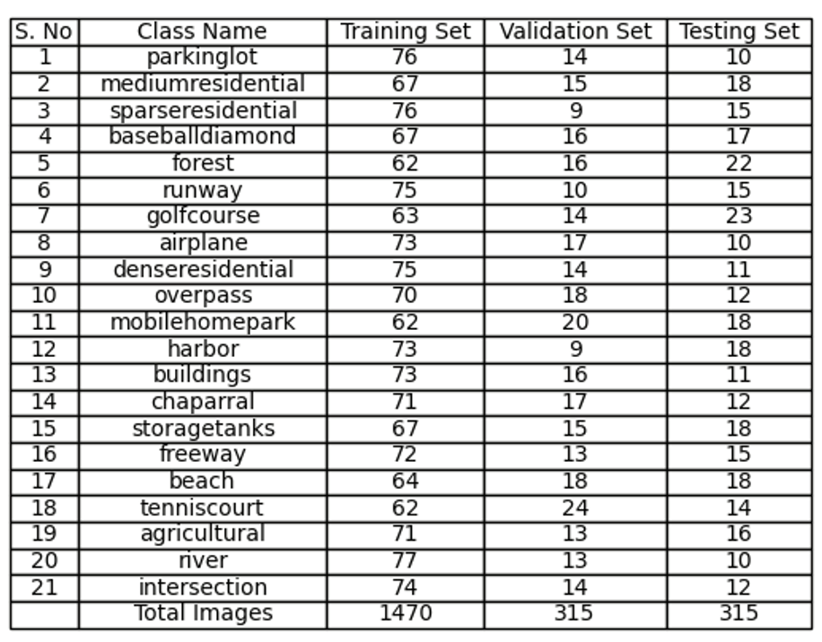
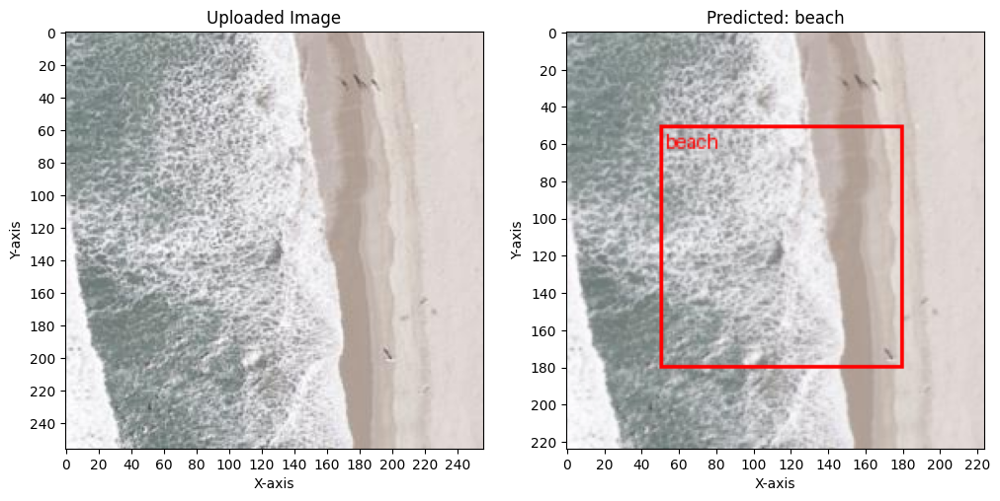

<h1>High-Resolution Satellite Image Classification Using Lightweight CNN with Depth wise Separable Convolutions.</h1>

📌 Introduction

This repository contains the implementation of multiple state-of-the-art deep learning architectures for crop disease classification using high-resolution satellite and macro-scale agricultural imagery. The models are designed to optimize computational efficiency while maintaining high classification accuracy, achieving an average accuracy of 95.7% across all models.

🚀 Models Used

The following architectures have been fine-tuned and optimized to enhance disease classification performance:
- DenseNet121 (DenseNet121_model.ipynb): Efficient feature propagation and reduced computational overhead.

- NASNetALarge (NASNetALarge_model.ipynb): Reinforced learning-based architecture with adaptive feature recalibration.

- SENet (SENet_model.ipynb): Squeeze-and-Excitation blocks for dynamic channel-wise feature enhancement.

- SE-ResNeXt50 (Se_ResNeXt50_model.ipynb): Multi-branch feature extraction with residual learning and attention mechanisms.

- TinyNet (TinyNet_model.ipynb): Lightweight yet powerful convolutional model for real-time inference.

📊 Key Features & Enhancements

- Adaptive Feature Recalibration: Models incorporate channel and spatial attention to refine feature extraction.

- Progressive Resizing & Test-Time Augmentation (TTA): Enhances model robustness and generalization across different image scales.

- Self-Distillation & Knowledge Transfer: Improves feature learning and optimizes the performance of smaller architectures.

- Class-wise Dataset Partitioning: Balanced dataset representation to mitigate bias and improve performance consistency.

📈 Performance Metrics

Each model has been evaluated using rigorous performance metrics:

- Accuracy: Average 95.7% across all models.

- ROC-AUC Curve: Comprehensive evaluation of classification thresholds.

- Precision-Recall Analysis: Ensures robustness against class imbalance.

- Confusion Matrix Visualization: Provides insights into misclassifications.

<h2>Train-Test-Validation split between classes</h2>

| Parameter               | Value                                      |
| ----------------------- | ------------------------------------------ |
| `Optimizer`            | Adam                                       |
| `Learning Rate`        | 0.0001                                     |
| `Batch Size`          | 32                                         |
| `Epochs`              | 50                                         |
| `Loss Function`       | Categorical Crossentropy                   |
| `Weight Initialization` | Xavier Initialization                    |
| `Activation Function`  | ReLU (Hidden Layers), Softmax (Output Layer) |
| `Dataset Split`       | 70% Training, 15% Validation, 15% Testing  |
| `Image Size`          | 256 x 256 pixels                           |
| `Number of Classes`   | 5-Fold                                     |

📬 Contact

For queries, feel free to reach out:

GitHub: ArnavGhosh999

Email: arnav032919@gmail.com
